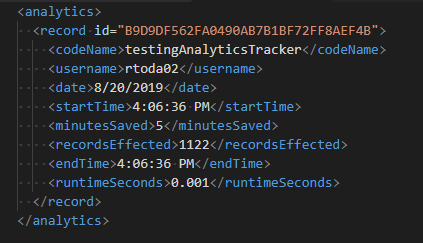

# VBA-Analytics
Way of tracking code analytics and metrics. Useful when multiple users are running code.

> Note this is the first version and will be improved upon! 0.0.1 

## Required
To use you need to import both `AnalyticsTracker` class and the `MicroStopWatch` class.

Additionaly you will need a reference to the `Microsoft xml, v6.0` library to use the xml objects.

## Usage

Initialize a new instance of `AnalyticsTracker` and call the method `Track` to start tracking. Place this near the top of your code or from the point you want to start tracking.

To finish the code you can either call `CompleteStats` or the `Class_Terminate()` method will also resolve the stats.

See the example below:

```vb
'/**
' * Example of how to work with AnalyticsTracker
' *
' * @author Robert Todar <robert@roberttodar.com>
' * @license MIT
' */
Private Sub testingAnalyticsTracker()
    ' Put this code at the start of your code. It will either complete
    ' after it is termintated, or by calling `CompleteStats`
    ' This code tracks stats for this method. [runtime, username, date]
    Dim analytics As New AnalyticsTracker
    
    ' This starts the tracking, takes in the code name and optionally the mins saved.
    analytics.Track "testingAnalyticsTracker"
    
    ' Can add custom records to xml
    analytics.AddField "recordsEffected", 1122
    
    ' Finalize the tracking by saying how many minutes were saved.
    ' If this wasn't called the code will still be completed on the terminate event.
    ' Just make sure that the minutes saved are on the `.Track` method.
    analytics.CompleteStats 5
End Sub
```

This will all be collected in an xml file at whatever the `filePath` constant is referenced to within the class. Set this first to make sure it is where you intend for it to be saved.


